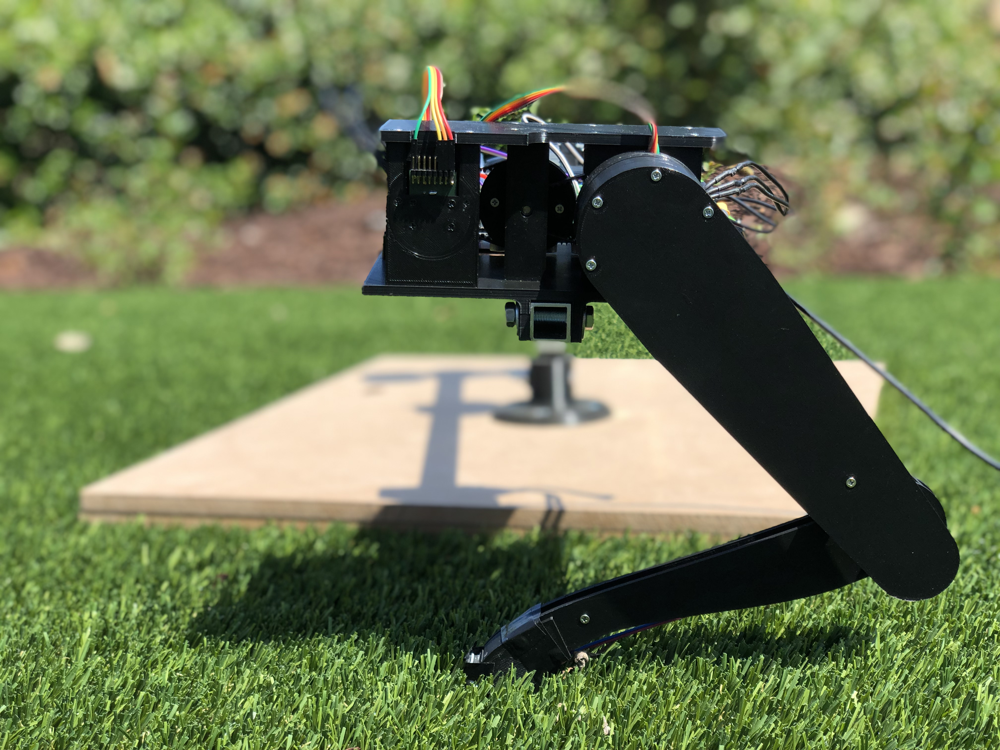

# Overleap

  

## Overview

Overleap is an open-source low-cost 3D printed dynamic robotic leg designed be as accessible as possible. Overleap can be assembled with only a 3D printer and minimal tools, without CNC milling / waterjet cutting / laser cutting like other robotic legs.

Overleap's building process is tailored to be simple and seamless, from the assembly manual to the programming method, creating a unique assembly experience.

In the future, overleap is planned to be used in other legged projects, such as a low-cost quadruped robot.

## Capabilities

The overleap leg is capable of executing quick and dynamic movements. Overleap can perform a single jump

  

as well as continous hopping in a circle

  

The height and stance time of each jump, as well as horizontal speed of the leg, can be varied as desired.

## Design

  

### Quasi-Direct Drive Actuation

Overleap uses quasi-direct drive actuators to drive the leg. The motors are geared down 9:1, allowing for increased torque while having high backdrivability and bandwidth.

To keep the footprint small, the gear system for the hip joint is housed beside the hip, while the gear system for the knee joint is housed within the upper leg. The actuators are coaxial in the sense that the knee motor is on the same axis as the hip motor output shaft.

### Custom foot contact sensor

A custom foot contact sensor was developed to detect when overleap was on the ground. This foot sensor is cheap and requires no machining/moulding.

The foot sensor consists of a 3D printed frame and rubber outer padding for grip. Force detection is made possible through the use of a force sensitive resistor mounted between the outer foot pad and the frame.

The minimum actuation force of the foot sensor is around 10 grams, and can be increased in software depending on the desired conditions.

