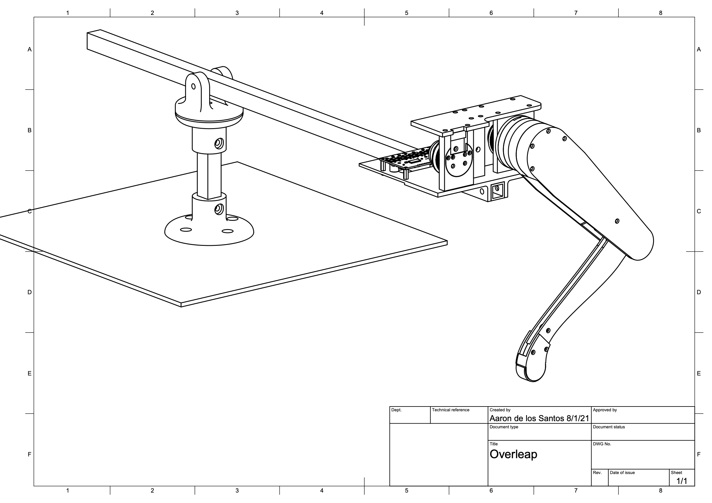

# Overleap

<p align="center">
  
</p>

## Overview

Overleap is an open-source low-cost 3D printed dynamic robotic leg designed be as accessible as possible. Overleap can be assembled with only a 3D printer and minimal tools, without CNC milling / waterjet cutting / laser cutting like other robotic legs.

Overleap's building process is tailored to be simple and seamless, from the assembly manual to the programming method, creating a unique assembly experience.

In the future, overleap is planned to be used in other legged projects, such as a low-cost quadruped robot.

## Capabilities

The overleap leg is capable of executing quick and dynamic movements. Overleap can perform a single jump

<p align="center">
  
</p>

as well as continous hopping in a circle

<p align="center">
  
</p>

The height and stance time of each jump, as well as horizontal speed of the leg, can be varied as desired.

## Design

<p align="center">
  
</p>

### Quasi-Direct Drive Actuation

Overleap uses quasi-direct drive actuators to drive the leg. The motors are geared down 9:1, allowing for increased torque while having high backdrivability and bandwidth.

To keep the footprint small, the gear system for the hip joint is housed beside the hip, while the gear system for the knee joint is housed within the upper leg. The actuators are coaxial in the sense that the knee motor is on the same axis as the hip motor output shaft.

### Custom foot contact sensor

A custom foot contact sensor was developed to detect when overleap was on the ground. This foot sensor is cheap and requires no machining/moulding.

The foot sensor consists of a 3D printed frame and rubber outer padding for grip. Force detection is made possible through the use of a force sensitive resistor mounted between the outer foot pad and the frame.

The minimum actuation force of the foot sensor is around 10 grams, and can be increased in software depending on the desired conditions.

### 2 DOF rotating base

For testing overleap, the leg is attached to a rotating base with 2 degrees of freedom. This allows the leg to move in both the vertical and horizontal (circular) direction.

The base plate is made out of presswood, while the actual rotating mechanism consists of 3D printed parts. Square aluminum tubes are used as the stand and boom to attach the leg.

### Controlling leg movement

Overleap works by directly controlling the torque of both motors. The microcontroller sends ASCII commands through UART to the ODrive motor controller for the desired torque of each axis. The calculation for these values of torque depends on the current phase of the leg.

During the stance phase (when the foot is touching the ground), overleap calculates a sinusoidal force profile that provides the desired impulse to the leg, then applies this force profile throughout the duration of the stance phase. To calculate the necessary torque values that achieve the desired force at the foot, the transpose of the Jacobian is used.

During the aerial phase, overleap runs a PD control loop to hold a predefined position until the foot comes into contact with the ground. While inverse kinematics can be used to calculate the angles of the leg to achieve the desired foot position, overleap defines the foot position using the joint angles directly as it is easy to visualize where the foot would be.

### Force profile

The force profile in the vertical (y) direction is a sinusoidal curve, specifically of the form a sin^2(b pi t).  The parameters a and b are calculated based on the desired force impulse and stance duration, and t is the time (duration) of the force application. This allows for the regulation of jumping height as well as gradual application of force.

In the horizontal (x) direction, the force applied is a set proportion of the vertical force. Horizontal speed can then be modulated by defining the maximum horizontal force to be applied. On top of allowing for gradual force application, this also keeps the foot firmly in contact with the ground even on slippery surfaces by taking into consideration its coefficient of friction.

## Parts

The full parts list and STL models for the 3D printed parts are available at the [parts](Parts) folder.

## Assembly

### Mechanical assembly

Start by installing all the heat set inserts into the parts. After installing, they should sit flush against the plastic and feel secure when tightening screws into them.

Next, glue the magnets that came with the AS5047P encoder evaluation board onto the back of the motor. Super glue or epoxy can be used for this.

Line up the rubber pad against the inner sensing area of the force sensitive resistor and cut the rubber to the same size. This will be used as the foot pad later on.

At this point, we will need to jump ahead to one portion of the electrical assembly and solder the jumper wires to the encoder. Solder 5 cables to the A, B, I, 5V, and GND outputs of the encoder board. Take note which wire colors correspond to which outputs, as this will be needed later on.

Now, we can continue with the mechanical assembly. As they say, a picture is worth a thousand words, so this guide will be presented as a series of clean and simple drawings similar to Ikea manuals.

These illustrations are designed to be simplistic and intuitive such that the placement of screws, timing belts, and bearings can easily be inferred from them.

You can also view the [complete assembly guide](Drawings/Complete_Assembly.pdf) compiled as a single PDF.

<p align="center">
  
  
  
  
  
  
  
  
  
  
  
  
  
  
  
</p>

### Electrical assembly

The electronic schematic for overleap is as follows:

<p align="center">
  
</p>

A power resistor can also be attached to the ODrive motor controller, if your power supply cannot dissipate excess current.

## Programming

### ODrive Set-up

As a side note, I wrote a [separate guide](https://github.com/aarondls/motor-position-control) on starting with the ODrive motor controller. This may be handy with getting familiar with ODrive.

Start by configuring the motors. Follow the "Configure M0" part on the ODrive [Getting Started](https://docs.odriverobotics.com/#configure-m0) page for both axis 0 and axis 1. The parameters used here are based on the T-Motor 4006 and AS5047 encoder:

* Current limit at 10A
* Velocity limit at 15 turns/sec
* Calibration current at 10A
* Pole pairs (number of magnet poles divided by 2) at 24 magnets / 2 = 12
* Torque constant at 8.27 / 380KV = 0.02176315789
* AS5047 CPR at 4000

Overleap will also use these additional configurations:

```bash
odrv0.config.enable_brake_resistor = True
odrv0.config.brake_resistance = 0.5
odrv0.config.dc_max_negative_current = -0.1
odrv0.config.max_regen_current = 0.5
```

Save the configuration and reboot.

```bash
<odrv>.save_configuration()
<odrv>.reboot();
```

Next is the motor calibration. Refer to the [AxisState](https://docs.odriverobotics.com/api/odrive.axis.axisstate) page for more information.

Begin by setting `motor.config.pre_calibrated` to `False`:

```bash
<odrv>.<axis>.motor.config.pre_calibrated  = False
```

Then, calibrate the motor:

```bash
<odrv>.<axis>.requested_state = AXIS_STATE_MOTOR_CALIBRATION
```

This just makes a beeping noise without moving the motor.

Now, set `motor.config.pre_calibrated` to `True`:

```bash
<odrv>.<axis>.motor.config.pre_calibrated = True
```

Save the configuration and reboot. Repeat this for both axis.

Finally, calibrate the encoders. For Overleap, ODrive interfaces with the AS5047 encoder through ABI. Follow the [Encoder with index signal](https://docs.odriverobotics.com/encoders.html#encoder-with-index-signal) part for both axis.

ODrive will search for the encoder index manually, so set `startup_encoder_index_search` to `False`.

```bash
<axis>.config.startup_encoder_index_search = False
```

This means that at every boot-up, Overleap will call

```bash
<axis>.requested_state = AXIS_STATE_ENCODER_INDEX_SEARCH
```

for each axis.

Note if motor wires are switched, make sure to run through this full calibration sequence again.

### Overleap Arduino library installation

The Overleap Arduino library is located at the [Overleap folder](Overleap). To install, follow these steps.

1. Download the Overleap folder. This may require cloning the repository.

2. In the Arduino IDE, select Sketch -> Include Library -> Add .ZIP Library.

3. Select the enclosing Overleap folder and hit Choose. Restart the Arduino IDE.

4. Verify that the Overleap library was installed by navigating to File -> Examples, and checking for the OverleapExample sketch.

This library provides an easy-to-use interface for Overleap that we will examine through the example sketch.

### Example sketch

The OverleapExample sketch has everything needed to get started with Overleap. It contains all the necessary code for the prechecks and demonstrates how to program Overleap.

For the remainder of the programming guide below, we will be using this example sketch.

### Prechecks

Before starting, we will need to run through a few checks to ensure everything functions as we expect. Start by ensuring the ODrive motor controller is properly set-up. Next, upload the OverleapExample sketch to the microcontroller.

Overleap will begin searching for the encoder index signal, starting with motor 0, then motor 1. Make sure that the leg has ample room to move around during this phase.

After searching for the encoder index, the list of available commands is printed out to the serial monitor. The ODrive vbus voltage is also printed out, and warns if voltage falls below 12V.

Since we are interfacing with the AS5047 encoder through ABI, we will need to calibrate where the zero degree position for the leg is. This zero degree position is where both θ<sub>0</sub> and θ<sub>1</sub> is zero degrees, where θ<sub>0</sub> is the angle of the upper leg with respect to the horizontal and θ<sub>1</sub> is the angle of the lower leg with respect to the upper leg. The angles θ<sub>0</sub> and θ<sub>1</sub> are illustrated by the diagram below.

<p align="center">
  
</p>

Type the character 'c', then follow the ensuing instructions to calibrate the zero degree position. Once finished, you can view relevant information of the leg, such as position in degrees and velocity in degrees per second for both axis, by typing the character 'd'.

We will need to verify that for axis 0, commanding positive torque results in clockwise rotation, while for axis 1, positive torque results in counterclockwise rotation. The reason for axis 0 being inverted compared with the convention is that ODrive uses the encoder rotation for direction, so simply swapping two wire leads will not change motor direction.

For this step, hold the leg to avoid it moving towards extreme angles. Type the character 'y' to begin this check. Overleap starts by moving motor 0, then waits for your confirmation before moving motor 1. Take note which direction the axis moves. If the motor does not move in the direction we expect, verify that your encoder wiring is correct. A swapped A and B wire could result in opposite rotation.

At every start-up, this sequence remains the same, except for verifying positive torque direction. Overleap begins by searching for the encoder index signal on both axis. Then, calibration of the zero degree position is needed. Finally, it is a good idea to verify that Overleap reads the correct degree position of the leg.

### Single jump

To perform a single jump, type the character 'j'. Let us examine the code in-depth to see how this works.

Before starting the jump, we need to ensure the current phase is on `TOUCHDOWN_PHASE`, as we start on the ground. This is done by calling the `SetCurrentPhase` function with the desired phase as the argument.

```c++
leg.SetCurrentPhase(TOUCHDOWN_PHASE);
```

Now, we are ready to control the leg, so we call the `EnterTorqueControl` function.

```c++
if (!leg.EnterTorqueControl()) {
  Serial.println("Aborting.");
  return;
}
```

`EnterTorqueControl` returns false if it is unable to sucessfully enter torque and closed loop control on the ODrive, so we print the abort message and stop if anything goes wrong.

After this, we set the desired impulse of the jump with the `UpdateForceProfile` function, with the desired impulse, desired maximum fx force, and proportion of fy applied as fx as the arguments. Impulse is in units of Newton millisecond, while force is in Newtons.

```c++
leg.UpdateForceProfile(2500.0f, 0, 0.4f);
```

In this case, we set fx_max to 0 since we want a single jump to go straight up.

Now, everything is set-up for a jump. The next thing to do is put the leg into a good starting position for jumping using the `HoldPosition` function.

```c++
leg.HoldPosition(25.0f, 110.0f, false, 3000);
```

The first two arguments tells Overleap to hold the position with θ<sub>0</sub> of 25 degrees and θ<sub>1</sub> of 110 degrees. The third argument is an end_at_touchdown boolean that signals whether the position hold should end if touchdown is detected (if the foot hits the ground). The fourth argument is the maximum time of the position hold in milliseconds. In this case, the position hold ends at 3000ms.

Finally, we can do a jump. This is done by executing the force profile set-up earlier using the `ExecuteForceProfile` function. Immediately after, we put the leg into a position ready for touchdown by calling `HoldPosition`.

```c++
leg.ExecuteForceProfile();
leg.HoldPosition(25.0f, 110.0f, true, 800);
```

Since end_at_touchdown is set, the position hold ends at either touchdown or 800ms, whichever comes first.

Finally, we put the leg into a position with enough time for us to secure it before it powers down, so it doesn't crash to the ground.

```c++
leg.HoldPosition(45.0f, 90.0f, false, 3000);
```

We can then request the idle state to end the jump.

```c++
leg.RequestIdleState();
```

### Continuous hopping

With a single jump done, let us try consecutive jumps by typing 'g'. Let us examine this code in detail to see how it is done.

It starts similarly with a single jump by setting the initial phase to `TOUCHDOWN_PHASE` and entering torque control.

```c++
leg.SetCurrentPhase(TOUCHDOWN_PHASE);

if (!leg.EnterTorqueControl()) {
  Serial.println("Aborting.");
  return;
}
```

The initial jump is different in that there is no downward momentum, so we start the initial jump with less impulse compared to the latter jumps.

```c++
leg.UpdateForceProfile(2200.0f, 10.0f, 0.4f);
```

We also set the maximum fx force to be 10N and the fx proportion to be 0.4. This means that the applied force in the x direction is 0.4 times the applied force in the y directions, capped at 10N.

Now, we can perform the initial jump. This is similar to the single jump earlier.

```c++
leg.HoldPosition(25.0f, 110.0f, false, 3000);
leg.ExecuteForceProfile();
leg.HoldPosition(25.0f, 110.0f, true, 800);
```

After this initial jump, we need to update the force profile with a larger impulse, since the leg will be touching down with a downward momentum.

```c++
leg.UpdateForceProfile(2600.0f, 10.0f, 0.4f);
```

Once this is set-up, we can execute multiple jumps in a for loop.

```c++
for (int jump=1; jump<10; jump++) {
  leg.ExecuteForceProfile();
  leg.HoldPosition(25.0f, 110.0f, true, 800);
}
```

At the end of the last jump, we want to end with the raised position with enough time to secure the leg before powering down.

```c++
leg.HoldPosition(45.0f, 90.0f, false, 4000);
```

Finally, we end by putting the leg into the idle state.

```c++
leg.RequestIdleState();
```

## Where to go from here

After going through the OverleapExample sketch, you are already familiar with the core functionality of Overleap and can begin coding your own Overleap controller.

The README of the [Overleap Arduino library](Overleap) lists relevant function declarations and contains detailed comments on their usage.

The framework of using touchdown and takeoff times for calculating the needed impulse to reache a desired height is already set-up, and you can modify the Overleap library for this functionality.

Have fun!
